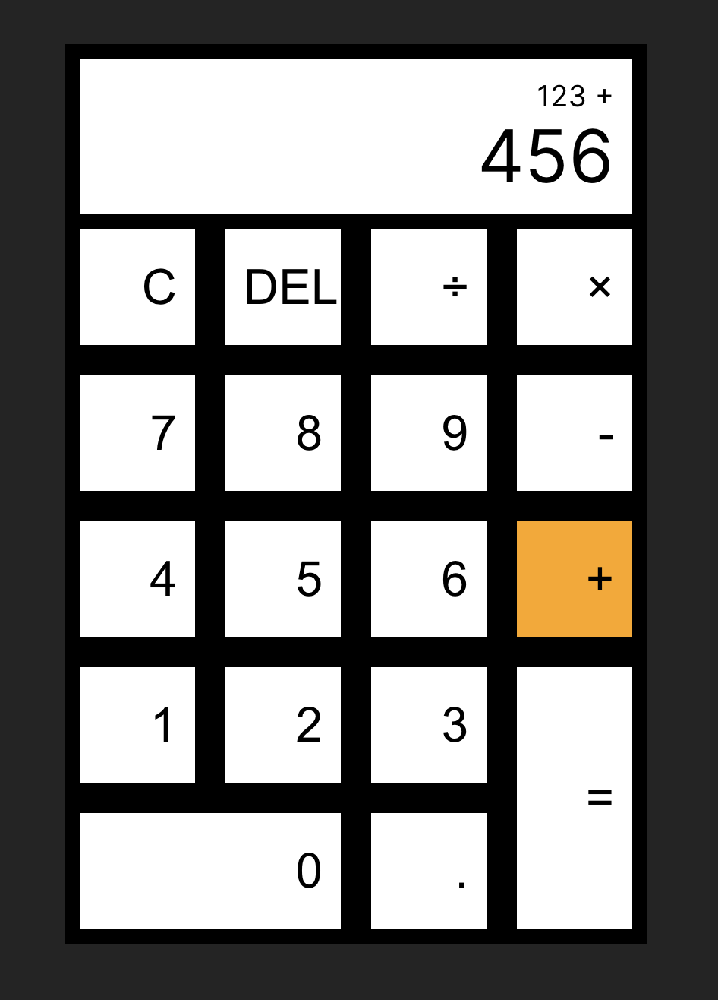

# Simple Calculator

A simple calculator built from Typescript, React.js and SCSS. It os deployed to https://react-ts-calculator-sepia.vercel.app for demo.

## Installation and Local Running

-   Install the dependencies by `npm install`, then run it with `npm run dev`. Or build it with command `npm run build`. After running it, we access the calculator on `http://localhost:5173`.

## Screenshots

